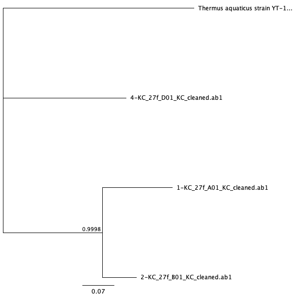

```{r setup, include = FALSE}
knitr::opts_chunk$set(echo = FALSE, message = FALSE, warning = FALSE)
```

```{r load-libraries}
library("ggplot2")
library("dplyr")
library("tidyr")
library("readr")
library("broom")
library("knitr")
```

# Introduction

# Methods

## Study design

The model of the experiment was ground beef and they were replicated by
purchasing 3 different brands: Teva kosher foods from Trader Joe’s, Lucky 
California from Lucky Supermarkets, and Butcher shop from Trader Joe’s.
The first treatment group remained refrigerated while the second treatment
group was stored at room temperature. For both treatment groups, they were
stored for 80 hours before subsampled.

### I - Subsampling

I dipped a sterile cotton swab in PBS buffer first and swabbed each sample 
on the surface for at least 10 seconds. Then, I broke off the tip of the 
cotton swab into the labeled tube and closed the cap. In order to conduct 
culturing and culture-free experiment for each sample in later steps, 
I collected total of 18 samples (n = 3 per group, 6 total).

### II - 1:10/1:100 dilution and microbial culture

I prepared 3 dilutions for each sample: the original stock, 1:10, and 1:100
using PBS buffer (total volume of 200uL each). For culturing process,
I transferred 100uL of each diluted sample to 100mm TSA plate and spread
the solution with the beads for 10 seconds. The petri dishes were stored
in incubator for growth of microbes.

### III – DNA Extraction and Quantification of DNA concentration

I chose 6 different bacterial morphotypes across the cultured sample and
added the cell from colony to a tube using a sterile pipette tip.
I performed DNA extraction by following the manufacturer’s protocol from
the Sigma REDExtract-N-Amp kit. After the extraction, I measured DNA
concentration using Qubit Fluorometer.

### IV – Touchdown PCR

I prepared the master mix for PCR using following ingredients:
Amp reagent, 27f primer, 1492r primer, BSA, and water. After aliquoting
the master mix and adding DNA to each tube, PCR started with denaturing
at 95⁰C for 5 minutes, another denaturing at 94⁰C for 30 seconds, annealing
at 65⁰C for 30 seconds, and extending at 72⁰C for 1 minute. The temperature
for annealing stepped down 1⁰C per cycle and the second denaturing,
annealing,and extending steps were repeated for 10 cycles. Subsequently,
additional 25 cycles were started at 94⁰C for 30 seconds, 55⁰C for
30 seconds, and 72⁰C for 1 minute. The cycle stayed at 72⁰C for 10 minutes
and went down to 4⁰C for hold.

### V – Gel Electrophoresis and PCR cleanups

I loaded 6 PCR products and a negative control on a 2% agarose gel
containing SYBR safe dye and ran the electrophoresis at 140V for
30 minutes. After inspecting the fluorescent bands under UV light,
PCR cleanups were performed using Invitrogen Exo-SAP and sent for
unidirectional Sanger sequencing using 27f primer at MCLAB in
South San Francisco, CA.

### VI – Sanger sequencing and Analysis

I used the software called Geneious Prime to analyze the integrity of the
sequencing data delivered from MCLAB. After reviewing the quality of the
samples, I determined 3 usable raw sequences with long stretches of
high-quality reads and trimmed it by removing poor quality reads near the
primer site and at the end. After cleaning the sequences, I aligned the
trimmed sequences along with Thermus aquaticus as an outgroup. In addition,
I used two phylogeny programs, PhyML and MrBayes, within Geneious Prime to
construct phylogenetic trees of the aligned sequences. Lastly, I loaded the
3 cleaned sequences and 1 failed sequence into BLAST to identify its gene
families.

# Results

## Culture Qubit DNA concentration

| Sample ID | DNA Conc. (ng/uL) |
|:---------:|:-----------------:|
|     1     |       10.50       |
|     2     |       25.50       |
|     3     |        7.56       |
|     4     |       15.10       |
|     5     |       12.40       |
|     6     |       14.30       |


```{r read-in-culture-data}
# read in the culture data from csv
culture_data <- read_csv(
  "data/raw_data/Raw_culture_count_data/Culturing_data.csv")
```

```{r filter-and-plot-abundances}
# filter out only my 100x dilutions and make a boxplot
culture_data %>%
  filter(student_name == "Kris Choi") %>%
  filter(dilution_1_10_or_100 == "1") %>%
  ggplot(aes(x = sample_group,
             y = number_of_colonies)) +
  geom_boxplot() +
  ggtitle(paste("Comparison of colony abundances",
  "between refrigerated and room temperature
storage conditions, 10x dilution")) +
  xlab("Sample Group") +
  ylab("Number of colonies")
```

**Figure 1:** Boxplot of colony abundances at different storage conditions, 
1x dilution. Despite a higher median number of colonies from room temperature 
samples, the mean numbers of colonies were not significantly different between 
the two storage conditions (Wilcox p = 0.06).

```{r abundances-stats}
# run a statistical test to compare the two groups of abundances
culture_data %>%
  filter(student_name == "Kris Choi") %>%
  filter(dilution_1_10_or_100 == "1") %>%
  wilcox.test(data = .,
              number_of_colonies ~ sample_group) %>%
  broom::glance(x = .) %>%
  knitr::kable()
```


```{r filter-and-plot-morphotypes}
# filter out only my 100x dilutions and make a boxplot
culture_data %>%
  filter(student_name == "Kris Choi") %>%
  filter(dilution_1_10_or_100 == "1") %>%
  ggplot(aes(x = sample_group,
             y = as.numeric(number_of_morphotypes))) +
  geom_boxplot() +
  ggtitle(paste("Comparison of colony morphotypes between refrigerated and",
  "room temperature
storage conditions, 1x dilution")) +
  xlab("Sample Group") +
  ylab("Number of Morphotypes")
```


**Figure 2:** Boxplot showing the number of morphotypes from the two different 
storage conditions. There was no difference in the mean number of morphotypes 
(Wilcox p=0.19).


```{r morphotypes-stats}
# run a statistical test to compare the two groups of morphotypes
culture_data %>%
  filter(student_name == "Kris Choi") %>%
  filter(dilution_1_10_or_100 == "1") %>%
  wilcox.test(data = .,
              as.numeric(number_of_morphotypes) ~ sample_group) %>%
  broom::glance(x = .) %>%
  knitr::kable()
```



# Discussion

# Sources Cited
