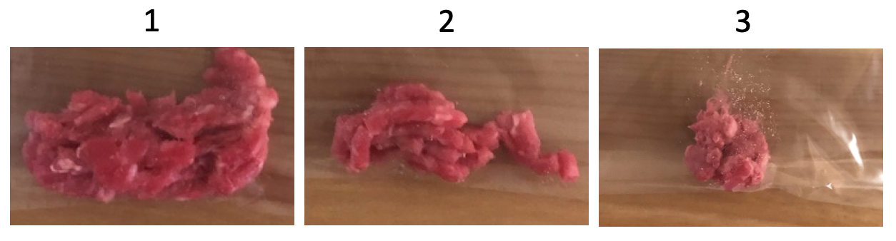
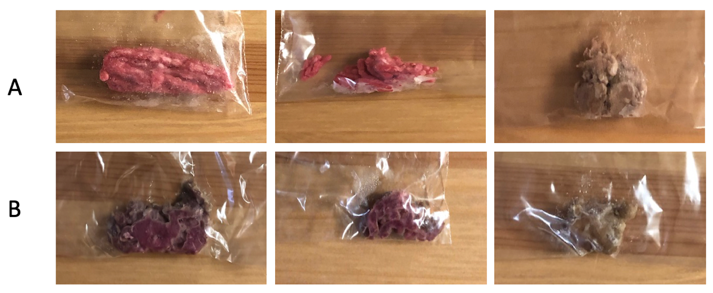

```{r setup, include = FALSE}
# create knit with correctly formated figures
knitr::opts_chunk$set(echo = FALSE, message = FALSE, warning = FALSE)
```

```{r load-libraries}
# run necessary packages to use in analysis
library("ggplot2")
library("dplyr")
library("tidyr")
library("readr")
library("broom")
library("knitr")
```

# Introduction

My primary question was to investigate microbial communities developed in
ground beef under different storage conditions. I proposed a hypothesis
that more diverse microbial communities would be developed if the meat was
stored at room temperature in comparison to the ones kept in a refrigerator
as low temperature storage is an essential method to prevent or slow
microbial growth [@dave2011meat]. I designed my study to compare 3 different
ground beef brands in either cooled environment or room temperature.
The samples stored in a refrigerator provided distinct colonies for
extraction while all the samples stored in room temperature resulted in
bacterial lawn. The bacterial lawn prevented DNA extraction process and
thus led to skewed results only from the refrigerated samples.

# Methods

## Study design

The model of the experiment was ground beef and they were replicated by
purchasing 3 different brands: Teva kosher foods from Trader Joe’s, Lucky
California from Lucky Supermarkets, and Butcher shop from Trader Joe’s.
The first treatment group remained refrigerated while the second treatment
group was stored at room temperature. For both treatment groups, they were
stored for 80 hours before subsampled.

## Subsampling

I dipped a sterile cotton swab in PBS buffer first and swabbed each sample
on the surface for at least 10 seconds. Then, I broke off the tip of the
cotton swab into the labeled tube and closed the cap. To conduct
culturing and culture-free experiment for each sample in later steps,
I collected total of 18 samples (n = 3 per group, 6 total).

## A. Process of cultured samples

### 1:10/1:100 Dilution and Microbial Culture

I prepared 3 dilutions for each sample: the original stock, 1:10, and 1:100
using PBS buffer (total volume of 200µL each). For culturing process,
I transferred 100µL of each diluted sample to 100mm TSA plate and spread
the solution with the beads for 10 seconds. The petri dishes were stored
in incubator for growth of microbes.

### DNA Extraction and Quantification of DNA concentration

I chose 6 different bacterial morphotypes across the cultured sample and
added the cell from colony to a tube using a sterile pipette tip.
I performed DNA extraction by following the manufacturer’s protocol from
the Sigma REDExtract-N-Amp kit. After the extraction, I measured DNA
concentration using Qubit Fluorometer.

### Touchdown PCR

I prepared the master mix for PCR using following ingredients:
Amp reagent, 27f primer, 1492r primer, BSA, and water. After aliquoting
the master mix and adding DNA to each tube, PCR started with denaturing
at 95⁰C for 5 minutes, another denaturing at 94⁰C for 30 seconds, annealing
at 65⁰C for 30 seconds, and extending at 72⁰C for 1 minute. The temperature
for annealing stepped down 1⁰C per cycle and the second denaturing,
annealing,and extending steps were repeated for 10 cycles. Subsequently,
additional 25 cycles were started at 94⁰C for 30 seconds, 55⁰C for
30 seconds, and 72⁰C for 1 minute. The cycle stayed at 72⁰C for 10 minutes
and went down to 4⁰C for hold.

### Gel Electrophoresis and PCR cleanups

I loaded 6 PCR products and a negative control for 4µL each on 2% agarose gel
containing SYBR safe dye and ran the electrophoresis at 140V for
30 minutes. After inspecting the fluorescent bands under UV light,
PCR cleanups were performed using Invitrogen Exo-SAP and sent for
unidirectional Sanger sequencing using 27f primer at MCLAB in
South San Francisco, CA.

### Sanger sequencing and Analysis

I used the software called Geneious Prime to analyze the integrity of the
Sanger sequencing data delivered from MCLAB. After reviewing the quality
of the samples, I determined 3 usable raw sequences with long stretches of
high-quality reads. I trimmed the sequences by removing poor quality reads
near the primer site and at the end and manually adjusting bases with IUPAC
ambiguity codes. After cleaning the sequences, I aligned the trimmed
sequences along with *Thermus aquaticus* as an outgroup. In addition,
I used two phylogeny programs, PhyML and MrBayes, within Geneious Prime to
construct phylogenetic trees of the aligned sequences. Lastly, I loaded the
3 cleaned sequences and 1 failed sequence into BLAST to identify its gene
families.

## B. Process of culture-free samples

### DNA Extraction and Quantification of DNA concentration
I performed DNA extraction by following the manufacturer’s protocol from
the Sigma REDExtract-N-Amp kit. After the extraction, I measured DNA
concentration using Qubit Fluorometer.

### PCR and Gel Electrophoresis
I prepared the master mix for PCR using following ingredients:
Amp reagent, 16SF primer, 16SR primer, BSA, and water. After aliquoting
the master mix and adding DNA to each tube, PCR started with denaturing
at 95⁰C for 3 minutes. Subsequently, additional 25 cycles were started at
95⁰C for 30 seconds, 55⁰C for 30 seconds, and 72⁰C for 30 seconds.
The cycle stayed at 72⁰C for 5 minutes and went down to 4⁰C for hold.
6 PCR products and a negative control were loaded on 2% agarose gel
containing SYBR safe dye and ran the electrophoresis at 140V for
30 minutes.

### Illumina sequencing and Analysis
Following electrophoresis, PCR products were purified using AmpureXP magnetic
beads and quantitated using a PicoGreen fluorescent assay on a Tecan Infinite
M Plex plate reader. Purified PCR products were used as the template for a
second round of PCR, which served to attach the Illumina barcodes and
adapters. PCR cycles started with denaturing at 95⁰C for 3 minutes followed
by additional 25 cycles starting at 95⁰C for 30 seconds, 55⁰C for 30 seconds,
and 72⁰C for 30 seconds. The cycle stayed at 72⁰C for 5 minutes and went down
to 4⁰C for hold. Following this amplification, PCR products were purified and
normalized with a SequelPrep normalization plate, pooled, and then quantified
once again with a Qubit 4 fluorometer (Invitrogen) and a TapeStation 4200
(Agilent) to verify library size and concentration. This library was then
combined with an Illumina PhiX spike-in library (5% spike in) and sequenced
on an Illumina iSeq using a 2 x 150 bp consumable cartridge.

# Results

### Observations of the samples before and after the 80-hour storage


**Figure 1A:** Images of each sample at the beginning of the experiment.
The first image (#1) was collected from Teva kosher foods at Trader Joe’s,
the second sample (#2) was from Lucky California at Lucky Supermarkets, and
the last sample was from Butcher shop at Trader Joe’s.


**Figure 1B:** Images of each sample 80 hours after the beginning of the
experiment. A represents the treatment group remained refrigerated and
B represents the treatment group stored at room temperature.

## A. Cultured samples

### Qubit DNA concentration and Gel Image

To demonstrate successful DNA extraction, I measured DNA concentration
values for each sample using Qubit Fluorometer (Figure 2B). The data
validated that all samples contain DNA in it and the values were within
2-30ng/µL range.  However, I found no bands in lane 6 and 7, sample #5
and 6 respectively, indicating no DNA separated from the sample (Figure 2C).
Sample #1, 2, and 4 showed bright bands while sample #3 produced
a faded band. All the visible bands are appeared to be about 1.5kb in
fragment size according to EZ Load 1 kb Molecular Ruler (Figure 2D).


**FIgure 2A:** TSA plates for each cultured sample after incubation.
The top plates were cultured from the sample collected from 
Teva kosher foods, Lucky California for the middle plates, and 
Butcher shop samples on the bottom.


| Sample ID | DNA Conc. (ng/µL) |
|:---------:|:-----------------:|
|     1     |       10.50       |
|     2     |       25.50       |
|     3     |        7.56       |
|     4     |       15.10       |
|     5     |       12.40       |
|     6     |       14.30       |

**Figure 2B:** DNA concentration values for culture samples. Sample ID 1 was
extracted from the original stock of refrigerated Teva kosher foods from
Trader Joe’s, 2 was extracted from 1:100 dilution of refrigerated Teva
kosher foods from Trader Joe’s, 3 and 4 were extracted from the original
stock of refrigerated Lucky California from Lucky Supermarkets, and
5 and 6 were extracted from the original stock of refrigerated Butcher shop
from Trader Joe’s.


**Figure 2C:** Gel image of culture samples. Ladder is shown in lane 1,
and the samples from 1 to 6 are located in lane 2-7. Negative control is
located in lane 8.


**Figure 2D:** Ladder used in lane 1 (EZ Load 1 kb Molecular Ruler #1708355).


### Comparison of colony abundances and morphotypes

In the boxplot to compare the colony abundances of two treatment groups in
1:10 dilution, the refrigerated samples showed widely spread values while
the samples from room temperature treatment group only showed 1,000
abundances with no other variations (Figure 3A). In fact, 1,000 was an
arbitrary number to represent the uncountable colony abundance observed
from all room temperature samples. No statistical significance was found
between the two storage conditions and it failed to reject the null
hypothesis (p = 0.20). Similarly in Figure 3B, a broad variation of the
colony morphotypes was illustrated in the boxplot for refrigerated samples.
The p-value of 0.81 shown in the data indicated no significant difference
between the two groups and the p-value close to 1 (0.81) suggested a strong
confident that the data is random.

```{r read-in-culture-data}
# read in the culture data from csv
culture_data <- read_csv(
  "data/raw_data/Raw_culture_count_data/Culturing_data.csv")
```

```{r filter-and-plot-abundances}
# filter out only the 10x dilutions and make a boxplot
culture_data %>%
  filter(student_name == "Kris Choi") %>%
  filter(dilution_1_10_or_100 == "10") %>%
  ggplot(aes(x = sample_group,
             y = number_of_colonies)) +
  geom_boxplot() +
  ggtitle(paste
          ("Comparison of colony abundances between
refrigerated and room temperature storage conditions,
10x dilution")) +
  xlab("Sample Group") +
  ylab("Number of colonies")
```

**Figure 3A:** Boxplot of colony abundances at different storage conditions,
10x dilution. Despite a higher median number of colonies from room temperature
samples, the sample groups were not significantly different between
the two storage conditions (Wilcox p = 0.20).


```{r abundances-stats}
# run a statistical test to compare the two groups of abundances
culture_data %>%
  filter(student_name == "Kris Choi") %>%
  filter(dilution_1_10_or_100 == "10") %>%
  wilcox.test(data = .,
              number_of_colonies ~ sample_group) %>%
  broom::glance(x = .) %>%
  knitr::kable()
```

```{r filter-and-plot-morphotypes}
# filter out only the 10x dilutions and make a boxplot
culture_data %>%
  filter(student_name == "Kris Choi") %>%
  filter(dilution_1_10_or_100 == "10") %>%
  ggplot(aes(x = sample_group,
             y = as.numeric(number_of_morphotypes))) +
  geom_boxplot() +
  ggtitle(paste("Comparison of colony morphotypes between
refrigerated and room temperature storage conditions,
10x dilution")) +
  xlab("Sample Group") +
  ylab("Number of Morphotypes")
```

**Figure 3B:** Boxplot showing the number of morphotypes from the two different
storage conditions. There was no statistical significance in the morphotypes
(Wilcox p=0.81).


```{r morphotypes-stats}
# run a statistical test to compare the two groups of morphotypes
culture_data %>%
  filter(student_name == "Kris Choi") %>%
  filter(dilution_1_10_or_100 == "10") %>%
  wilcox.test(data = .,
              as.numeric(number_of_morphotypes) ~ sample_group) %>%
  broom::glance(x = .) %>%
  knitr::kable()
```


### Sanger Sequencing and Phylogenetic Trees

After loading the Sanger sequencing data in Geneious Prime, I obtained
3 solid data, 3 completely failed data including the negative control,
and 1 seemingly failed data (Figure 4A). I used the 3 successful data after
trimming to create Maximum Likelihood and Bayesian phylogenetic trees
with *Thermus aquaticus* as an outgroup (Figure 4A, 4B) and found a strong
evidence from both phylogenies that support to group Sample #1 and 2
as a monophyletic group (Bayesian posterior probability = 0.9998,
ML bootstrap = 98).

| ID | Original File Name |    File Name after Correction    | Usable? | Length after Trimming | Manually Adjusted Bases |
|:--:|:------------------:|:--------------------------------:|:-------:|:---------------------:|:-----------------------:|
|  1 |  1-KC_27f_A01.ab1  |    1-KC_27f_A01_KC_cleaned.ab1   |   Yes   |          611          |            16           |
|  2 |  2-KC_27f_B01.ab1  |    2-KC_27f_B01_KC_cleaned.ab1   |   Yes   |          713          |            36           |
|  3 |  3-KC_27f_C01.ab1  | 3-KC_27f_C01_KC_failed_blast.ab1 |    No   |          N/A          |           N/A           |
|  4 |  4-KC_27f_D01.ab1  |    4-KC_27f_D01_KC_cleaned.ab1   |   Yes   |          552          |            8            |
|  5 |  5-KC_27f_E01.ab1  |    5-KC_27f_E01_KC_failed.ab1    |    No   |          N/A          |           N/A           |
|  6 |  6-KC_27f_F01.ab1  |    6-KC_27f_F01_KC_failed.ab1    |    No   |          N/A          |           N/A           |
|  7 |  7-KC Neg Control  |    7-KC Neg Control_KC_failed    |    No   |          N/A          |           N/A           |

**Figure 4A:** Sanger sequencing data for each sample analyzed by Geneious
Prime.


**Figure 4B:** Bayesian phylogenetic tree constructed by MrBayes.


**Figure 4C:** Maximum Likelihood phylogeny constructed by PhyML.


### Identification of Samples using BLAST 

I provided 3 successful data (Sample #1, 2, and 4) and 1 seemingly failed
data (Sample #3) into BLAST to identify each sample and observed 4 different
identifications with strong evidence to support the data (Figure 5).

| ID |           Description          | % Identity | Query cover |  Accession | E-value |
|:--:|:------------------------------:|:----------:|:-----------:|:----------:|:-------:|
|  1 |    *Acinetobacter baumannii*   |    97.38   |     100%    | CP044356.1 |    0    |
|  2 |        *Hafnia paralvei*       |    96.36   |     96%     | MK995600.1 |    0    |
|  3 |      *Kocuria rhizophila*      |    90.46   |     77%     | KY522908.1 |  5e-136 |
|  4 | *Staphylococcus saprophyticus* |    98.55   |     100%    | MH930439.1 |    0    |

**Figure 5:** Identification of each sample conducted by BLAST.


## B. Culture-free samples

### Qubit DNA concentration and Gel Image

I measured DNA concentration values for culture-free samples using Qubit
Fluorometer (Figure 6A). The data validated that all samples contain DNA
in it.  However, I found a bright band only in lane 6 and did not observe
any bands in other lnaes. The gel image showed that there was no DNA
separated except for the sample #3B in lane 6 (Figure 6C).

| Sample ID | DNA Conc. (ng/µL) |
|:---------:|:-----------------:|
|     1A    |        2.14       |
|     1B    |        3.39       |
|     2A    |        2.11       |
|     2B    |        2.17       |
|     3A    |        1.10       |
|     3B    |        4.62       |

**Figure 6A:** DNA concentration values for culture-free samples. Sample ID
1A and 1B were extracted from Teva kosher foods (Trader Joe’s), 2A and 2B
were Lucky California (Lucky Supermarkets), and 3A and 3B were obtained
from Butcher shop (Trader Joe’s). The letter A corresponds to the refrigerated
samples and B indicates the storage condition at room temperature.


| Sample ID | DNA Conc. (ng/µL) |
|:---------:|:-----------------:|
|     1A    |        6.60       |
|     1B    |        3.20       |
|     2A    |        4.82       |
|     2B    |        5.24       |
|     3A    |        5.70       |
|     3B    |       16.30       |

**Figure 6B:** DNA concentration values for the PCR product of
culture-free samples. Notice sample #3B exhibited the highest concentration
value as it was the only bright band observed on the gel image.


**Figure 6C:** Gel image of culture-free samples. Samples from 1A to 3B are
located in lane 1-6. Negative control is loaded in lane 7 and the ladder is
shown in lane 8.


### Trimming sequences with Trimmomatic and sequence quality

Before analyzing the sequence data, I inspected the quality of the sequences
by reviewing FastQC reports. The graph is divided into green, yellow, and
red regions to represent the quality of the sequences and the blue line (mean
quality) in every samples remained in green as the indication of great
quality of all samples (Figure 7A).

As mentioned earlier, I manually trimmed the raw sequence data for the
cultured samples using the software called Geneious Prime. Contrarily, I ran
Trimmomatic in bash to automatically trim the culture-free samples and only
a few hundred sequences were removed for all the samples as a result of the
great quality of the sequence (Figure 7B).


**Figure 7A:** Quality check of the sequences for each sample using FastQC
reports. Y-axis shows the quality score and thge green region represents great
quality, reasonable quality in yellow region, and poor quality in red region.


| Group | Before trimming | After Trimming |
|:-----:|:---------------:|:--------------:|
|   1A  |       7951      |      7549      |
|   1B  |       3807      |      3638      |
|   2A  |      13669      |      13073     |
|   2B  |      10640      |      10118     |
|   3A  |      12207      |      11598     |
|   3B  |      10155      |      9665      |

**Figure 7B:** Number of sequences before and after removing bad sequences
using Trimmomatic.


### Command-line BLAST analysis

I looked into the number of different taxa in each sample and compared
between the two treatment groups: samples stayed refrigerated (A) and
those stored at room temperature (B). I observed larger number of different
taxa in sample #2 and 3 for group B as expected, but the first samples showed
lesser number of taxa in group B (Figure 8A).

In addition, I ran BLAST on bash to find the major taxa of each sample
based on the number of sequences. Interestingly, I found bacterias as the
major taxa for all samples except for 1A which identified to be
*Bos mutus*, the domestic yak (Figure 8B).


| Sample ID | # of different taxa |
|:---------:|:-------------------:|
|     1A    |          25         |
|     1B    |          22         |
|     2A    |          21         |
|     2B    |          30         |
|     3A    |          15         |
|     3B    |          24         |

**Figure 8A:** Number of different taxa from each sample. The letter A
corresponds to the refrigerated storage treatment group and B indicates the
room temperature storage treatment group.


| Sample ID |                  Major Taxa                  |
|:---------:|:--------------------------------------------:|
|     1A    |                  *Bos mutus*                 |
|     1B    |          *Carnobacterium divergens*          |
|     2A    |            *Lactobacillus algidus*           |
|     2B    |          *Carnobacterium divergens*          |
|     3A    | *Leuconostoc gelidum* subsp. *gasicomitatum* |
|     3B    |             *Lelliottia amnigena*            |

**Figure 8B:** Major taxa for each sample.


# Discussion

## Analysis of cultured-samples

I questioned a level of microbial communities in ground beef under different
storage conditions and expected to observe more diverse communities from the
samples stored at room temperature than refrigerated samples. However, the
petri dishes of the room temperature samples were covered by bacterial lawn
instead of forming colonies and no distinct morphotypes were observed
(Figure 2A).

The factor that might have influenced the bacterial lawn in all
room temperature samples can be the long duration of swabbing on the
surface when subsampled. The highly concentrated stock sample could be the
possible cause of the thick bacterial lawn even though it was diluted down
to 1:100. The boxplots in Figure 3A and 3B were displaying data from
skewed results due to the unreliable outcomes from room temperature samples.
A different approach to enhance the results could be by using streaking
method and/or shortening the time when swabbing the sample on the surface.

The gel image from electrophoresis showed no bands for Sample #5 and #6
which corresponded to the failed Sanger sequencing data, and the faded band
for Sample #3 corresponded to the seemingly failed Sanger sequencing data.
Some possible speculations that influenced no bands for Sample #5 and #6
could be contamination of tubes and/or pipetting errors.

4 different identifications were generated from BLAST for Sample
#1, 2, 3, and 4: *Acinetobacter baumannii*, *Hafnia paralvei*,
*Kocuria rhizophila*, and *Staphylococcus saprophyticus* respectively
(Figure 5). All of the samples except for the complete failures was
identified with strong confidence to support the results even for
the Sample #3 which showed a faded band on the gel and provided the
seemingly failed result from Sanger sequencing data. The results exhibited
high percent identity and query coverage values with exceptionally small
to zero E-values. However, the phylogenic results that grouped Sample #1
and #2 did not match with BLAST results.

## Analysis of culture-free samples

There are commonly known mirobial groups that contribute to spoil meat even
in refrigerated condition and they were identified across from all samples as
expected. Those microbes include: *Serratia*, *Enterobacter*, *Pantoea*,
*Proteus*, *Hafnia*, and lactic acid bacteria such as *Lactobacillus* and
*Carnobacterium* [@ercolini2006changes]. Among the 4 identifications
observed from cultured samples, *Acinetobacter baumannii*,
*Hafnia paralvei*, and *Staphylococcus saprophyticus* were also identified
from culture-free samples and confirmed the matches between culture-based and
culture-free samples using Sanger sequences and Illumina sequences.
However, no matches for *Kocuria rhizophila* from sample #3 of cultured sample
(Figure 5) was found in culture-free sample.

Initially, I hypothesized to see more developed microorganism communities
from the samples stored at room temperature than the ones kept refrigerated
because the temperature conditions play a critical role in meat spoilage
[@dohlen2017effect]. Two brands out of three exhibited to have more number
of different taxa when it was stored at room temperature while the first
sample, Teva kosher foods from Trader Joe’s, showed less 


# Sources Cited
